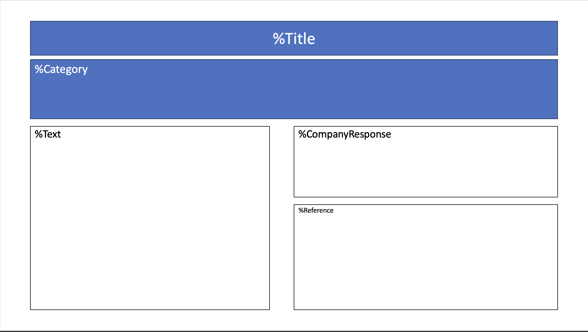
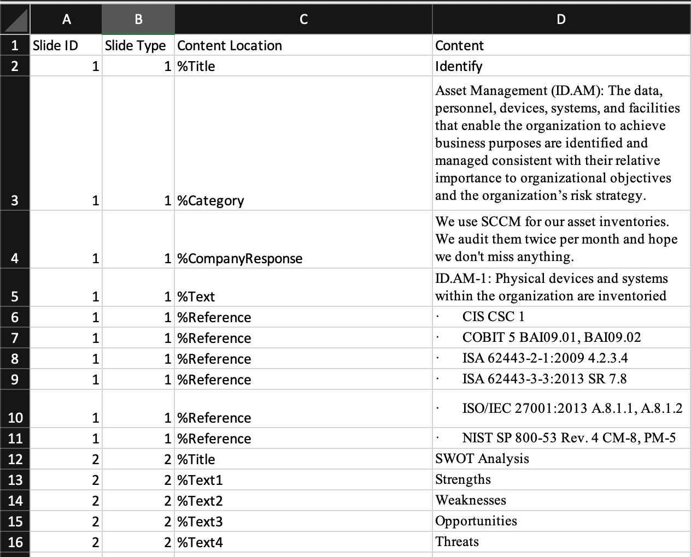

# Excel-to-PPT

## Description
Excel-to-PPT is a tool written in Python for simplifying the process of building PowerPoint slides based on an Excel workbook. In this repo, you'll find the source code and two templates, one for your Excel content and one for your slide template.

## Usage
1. The ideal way to use this tool would be to define the slide templates first.

2. Each shape in your slide template that you wish to be populated with content from your Excel workbook should contain a unique annotation. In our sample workbook, these keys are illustrated with %symbols.

3. Within your Excel file you'll need to define four columns, Slide ID, Slide Type, Content Location, and Content.
  - Slide ID is the slide where this content will be populated. Your content must be arranged by slide in sequential order. For example, if I wanted 25 slides, I would use slides 1 through 25 in my Excel workbook.
  - Slide Type is the template slide you would like to be populated. This is to be defined using sequential numbering in your PowerPoint presentation (slide 1 is the first slide in the template, slide 2 in the second slide in the template, and so on...)
  - Content Location is the annotation of the shape where you would like content to be placed.
  - Content is the content to be added to the shape referenced by our annotation.

