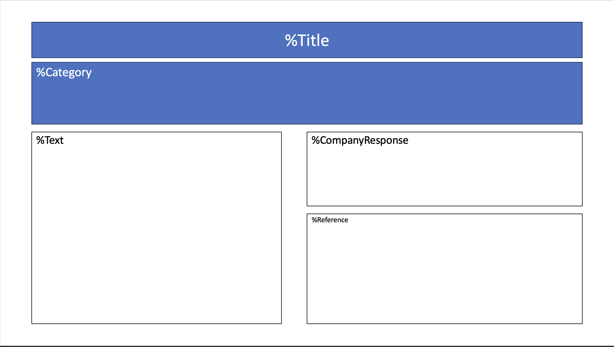
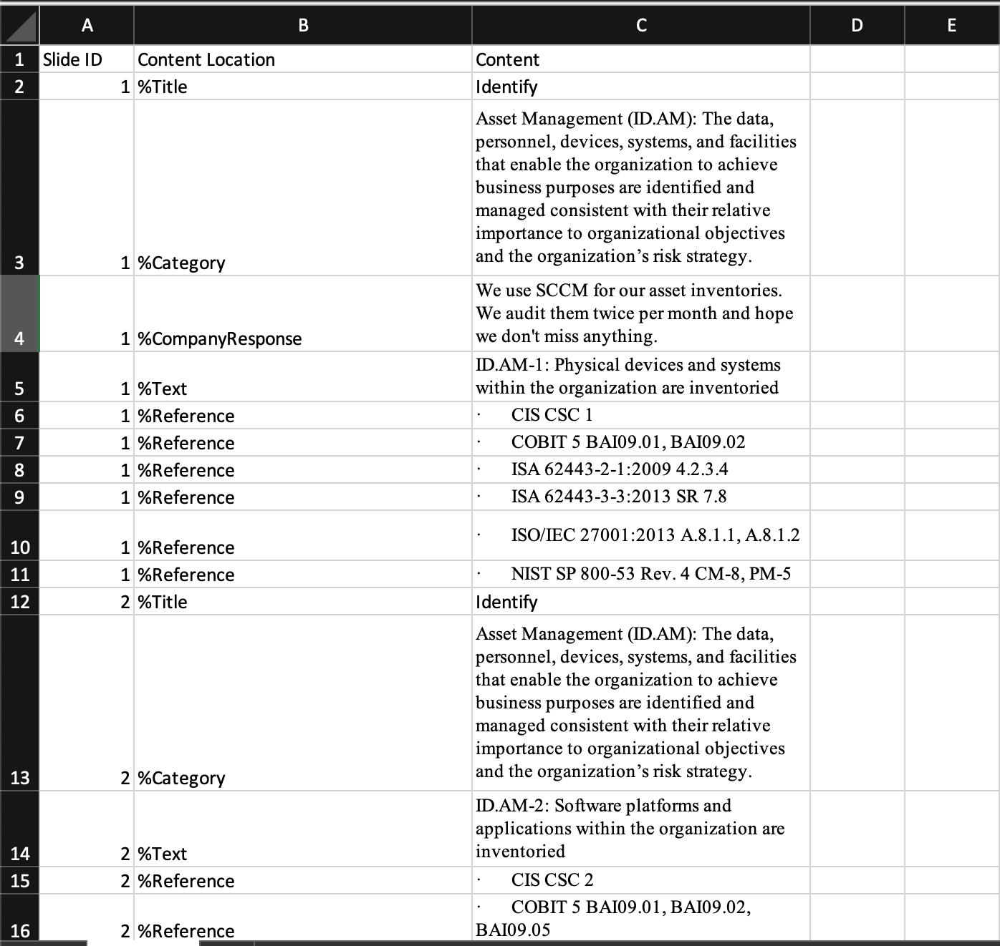

# Excel-to-PPT

## Description
Excel-to-PPT is a python based tool meant to simplify the process of building powerpoint slides based on an excel workbook. In this repo, you'll find the source code and two templates, one for your excel content and one for your slide template.

## Current Limitations
Currently, Excel-to-PPT only supports one slide template per transformation. If you would like multiple slide templates, you'll need to upload individual templates and content workbooks in multiple runs. Stay tuned for updates as we move to support multiple slide templates in the coming weeks.

## Usage
1. The ideal way to use this tool would be to define the slide template first.

2. Each shape in your slide template that you wish to be populated with content from your excel workbook should contain a unique annotation. In our sample workbook, these keys are illustrated with %symbols.

3. Within your excel file you'll need to define three columns, Slide ID, Content Location, and Content.
  - Slide ID is the slide where this content will be populated. For ease, you should use sequential numbering equal to the number of total slides. For example, if I wanted 25 slides, I would use slide 1 through 25 in my excel workbook.
  - Content Location is the annotation of the shape where I would like to put content.
  - Content is the content to be added to shape referenced by our annotation.

